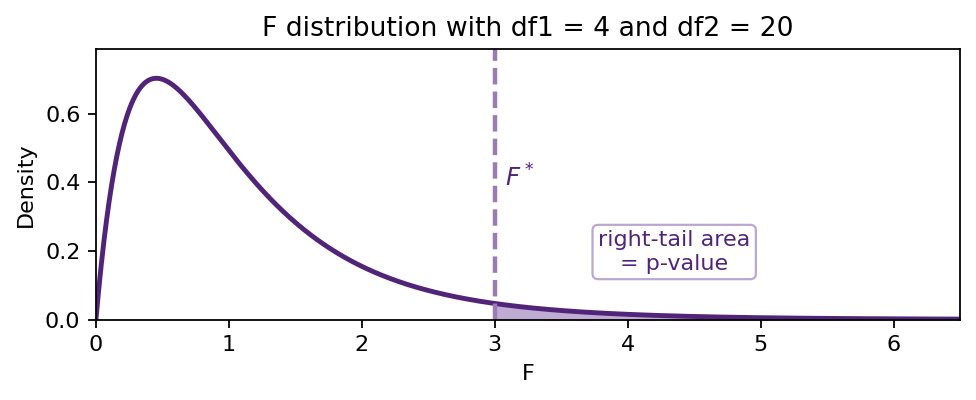
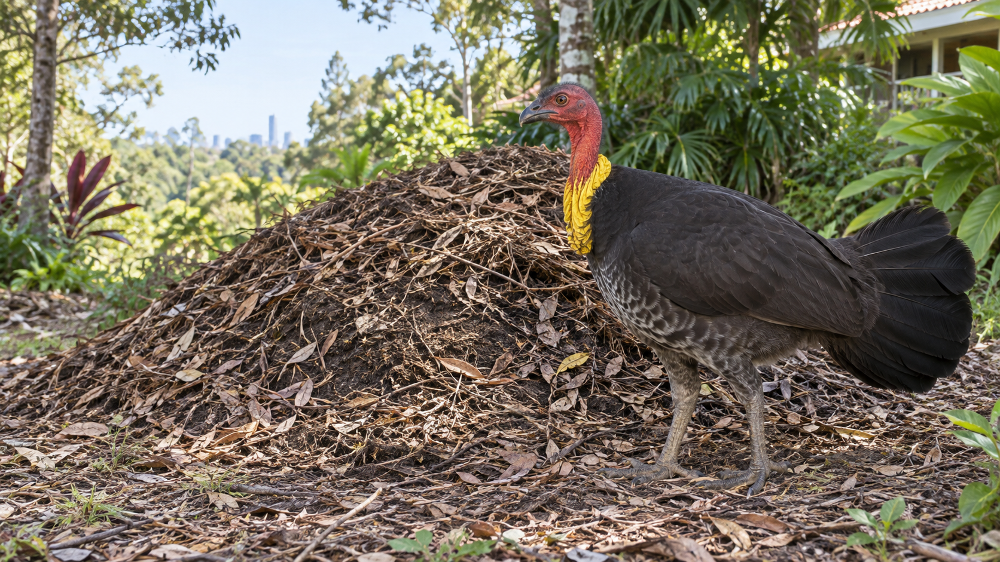

## Teaching demonstration

First the F distribution. Then one-way ANOVA. Then a local UQ brush-turkey example.

::: {.callout}
Theory first, followed by an illustrative data analysis.
:::

---

## Lecture road map

::: {.defbox}
1. The F distribution and right-tail probabilities  
2. One-factor ANOVA notation and model  
3. How ANOVA decomposes variation  
4. A UQ brush-turkey example: visualizing, hand calculation, then R
:::

---

## The F distribution {.compact-theory}

The **F distribution** is a family of continuous probability distributions named after R. A. Fisher.

::: {.three-col .compact-cards}
::: {.card}
<span class="label">Family notation</span>

We write $F(df_1,df_2)$.
:::

::: {.card}
<span class="label">Two degrees of freedom</span>

$df_1$ is the numerator df and $df_2$ is the denominator df.
:::

::: {.card}
<span class="label">R functions</span>

Use `df()`, `pf()`, `qf()`, and `rf()`.
:::
:::

::: {.thinkbox}
In ANOVA, the F distribution is the reference distribution for the ratio $MSF/MSE$.
:::

---

## F-distribution probability calculator {.compact-theory}

Use the app below to calculate left-tail or right-tail probabilities from an $F(df_1,df_2)$ distribution.

<iframe class="f-app-frame" src="../apps/f-distribution-calculator.html" title="F distribution probability calculator"></iframe>

---

## Why ANOVA? {.compact-theory}

**Analysis of Variance (ANOVA)** is used to compare several population means at once.

::: {.three-col .compact-cards}
::: {.stat-card}
<span class="label">Setting</span>

There are $d\ge 3$ groups or factor levels.
:::

::: {.stat-card}
<span class="label">Global question</span>

Do all groups have the same population mean?
:::

::: {.stat-card}
<span class="label">Next step</span>

If the global test rejects, compare pairs carefully.
:::
:::

::: {.defbox}
$$
H_0:\mu_1=\mu_2=\cdots=\mu_d.
$$
:::

---

## One-factor ANOVA model and notation {.model-slide}

ANOVA (Analysis of Variance) compares several population means at once. Suppose we have $d$ groups, with $d \ge 3$.

The one-factor ANOVA model is

$$
Y_{ik}=\mu+\tau_i+\epsilon_{ik}, \qquad \epsilon_{ik}\sim N(0,\sigma^2).
$$

Equivalently,

$$
Y_{ik}=\mu_i+\epsilon_{ik}, \qquad \epsilon_{ik}\sim N(0,\sigma^2),
\qquad \mu_i=\mu+\tau_i.
$$

::: {.model-defs .model-defs-wide}
- $Y_{ik}$: response for observation $k$ in group $i$
- $\mu$: overall mean
- $\tau_i$: effect for group $i$
- $\epsilon_{ik}$: random error
- $\mu_i$: mean for group $i$
- $\sigma^2$: common variance
:::

::: {.thinkbox}
The model assumes independent errors, approximate normality within groups, and a common variance across groups.
:::

---

## Overall mean and sources of variation {.compact-theory .overall-variation-slide}

::: {.overall-variation-layout}
::: {.overall-table-top}
::: {.data-layout-table .overall-data-table}
|  | Group 1 | Group 2 | $\cdots$ | Group $d$ |
|:---|:---:|:---:|:---:|:---:|
| Observation 1 | $Y_{11}$ | $Y_{21}$ | $\cdots$ | $Y_{d1}$ |
| Observation 2 | $Y_{12}$ | $Y_{22}$ | $\cdots$ | $Y_{d2}$ |
| $\vdots$ | $\vdots$ | $\vdots$ | $\ddots$ | $\vdots$ |
| Observation $n_i$ | $Y_{1n_1}$ | $Y_{2n_2}$ | $\cdots$ | $Y_{dn_d}$ |
| Mean | $\bar Y_1$ | $\bar Y_2$ | $\cdots$ | $\bar Y_d$ |
| Sample variance | $S_1^2$ | $S_2^2$ | $\cdots$ | $S_d^2$ |
| Sample size | $n_1$ | $n_2$ | $\cdots$ | $n_d$ |
:::

::: {.mini-note .center}
$\bar Y_i$, $S_i^2$, and $n_i$ are the sample mean, sample variance, and sample size for group $i$.
:::
:::

::: {.overall-mid-grid}
::: {.variation-cell}
<span class="mini-title">Total sample size</span>
$$
n=n_1+n_2+\cdots+n_d
$$
:::

::: {.variation-cell}
<span class="mini-title">Overall mean</span>
$$
\bar Y=\frac{1}{n}\sum_{i=1}^{d}\sum_{k=1}^{n_i}Y_{ik}
=\frac{1}{n}\sum_{i=1}^{d}n_i\bar Y_i
$$
:::

::: {.variation-cell}
<span class="mini-title">Within groups: error variation</span>
$$
SSE=\sum_{i=1}^{d}(n_i-1)S_i^2
$$
:::

::: {.variation-cell}
<span class="mini-title">Between groups: factor variation</span>
$$
SSF=\sum_{i=1}^{d}n_i(\bar Y_i-\bar Y)^2
$$
:::
:::

::: {.variation-total}
<span class="mini-title">Total source of variation</span>
$$
SST=SSF+SSE,
\qquad
SST=\sum_{i=1}^{d}\sum_{k=1}^{n_i}(Y_{ik}-\bar Y)^2
$$
:::
:::

---

## ANOVA table and hypothesis test {.compact-theory .anova-table-test-slide}

| Source | df | SS | MS | $F$ |
|---|---:|---:|---:|---:|
| Factor | $d-1$ | $SSF$ | $MSF=SSF/(d-1)$ | $MSF/MSE$ |
| Error | $n-d$ | $SSE$ | $MSE=SSE/(n-d)$ |  |
| Total | $n-1$ | $SST$ |  |  |

<div class="table-gap"></div>

::: {.defbox .full-width-block}
<span class="label">Hypotheses</span>

$$
\begin{aligned}
H_0&:\mu_1=\mu_2=\cdots=\mu_d \\
H_a&:\text{at least one mean is different.}
\end{aligned}
$$
:::

::: {.thinkbox .full-width-block .reference-dist-block}
::: {.ref-dist-grid}
::: {.ref-dist-text}
<span class="label">Test statistic and reference distribution</span>

$$
F=\frac{MSF}{MSE}\sim F(d-1,n-d)\quad \text{under }H_0.
$$

The p-value is a **right-tail probability**.
:::

::: {.anova-ref-figure}


::: {.source-note .center}
Illustration of a right-tail p-value for an $F(4,20)$ curve.
:::
:::
:::
:::

---

## P-value from the F distribution {.compact-theory}

For an observed ANOVA statistic $F^*$,

$$
p\text{-value}=P\{F(d-1,n-d)\ge F^*\}.
$$

<div id="theory-pvalue-plot" class="pvalue-plot"></div>

::: {.warnbox}
Large values of $F^*$ mean the between-level mean square is large relative to the within-level mean square, so ANOVA uses the right tail.
:::

---

## Illustrative example: brush-turkeys at UQ {.compact-theory}

::: {.two-col-wide .example-photo-slide}
::: {.col}
- Study: Eiby and Booth (2009), *Journal of Comparative Physiology B*.
- Researchers: Yvonne A. Eiby and David T. Booth, School of Biological Sciences, The University of Queensland.
- Eggs came from brush-turkeys breeding on UQ's St Lucia campus.

::: {.callout}
A local UQ example makes ANOVA feel like a scientific modelling tool rather than a table-only procedure.
:::
:::
::: {.col}
{.rounded .example-photo width="100%"}
:::
:::

---

## Research question and variables {.compact-theory}

::: {.two-col}
::: {.col}
::: {.defbox}
<span class="label">Research question</span>

Does incubation temperature affect the mean incubation period of Australian Brush-turkey eggs?
:::

::: {.stat-card}
<span class="label">Factor levels</span>

32 °C, 34 °C, 36 °C.
:::
:::
::: {.col}
{.rounded width="100%"}

::: {.stat-card}
<span class="label">Response</span>

Incubation period in days.
:::
:::
:::

---

## Data provenance: be transparent {.compact-theory}

The data are reconstructed integer incubation periods that reproduce the published group means and standard errors. The per-egg values are not the authors' original observations.

::: {.thinkbox}
The published F statistic is $F(2,25)$. Since $d=3$ levels, $n=25+3=28$ observations in the incubation-period ANOVA.
:::

::: {.source-note}
Reference: Eiby, Y. A., & Booth, D. T. (2009). The effects of incubation temperature on the morphology and composition of Australian Brush-turkey (*Alectura lathami*) chicks. *Journal of Comparative Physiology B*, 179, 875–882. <https://doi.org/10.1007/s00360-009-0370-4>
:::

---

## First look: boxplots before the test {.code-slide}

Before calculating the ANOVA table, compare the distributions visually. The Plotly boxplot shows boxes and whiskers only: no individual points and no zoom/cropping.

```{=html}
<div class="live-r-cell" id="cell-box" data-mode="plotly-box"><div class="live-r-toolbar"><button onclick="runLiveRCell('box')">Run code</button><span class="live-r-status">R runs in the browser. First run may take a moment.</span></div><textarea class="live-r-code" spellcheck="false">brush_turkey <- read.csv("brushturkey_incubation.csv")
names(brush_turkey)[names(brush_turkey) == "incubation_period"] <- "incubation_days"
brush_turkey$temperature <- factor(brush_turkey$temperature, levels = c(32, 34, 36))

aggregate(incubation_days ~ temperature, data = brush_turkey, summary)</textarea><div class="live-r-output" id="output-box">Click Run code.</div></div>
```


---

## Hand calculation: summaries, sums of squares, and F statistic {.handcalc-slide .handcalc-combined}

::: {.handcalc-grid}
::: {.handcalc-summary}
<span class="label">Group summaries</span>

| Group | $n_i$ | $\bar y_i$ | $s_i^2$ | $se_i$ |
|:---:|---:|---:|---:|---:|
| 32 °C | 10 | 51.400 | 1.600 | 0.400 |
| 34 °C | 10 | 46.700 | 1.567 | 0.396 |
| 36 °C | 8 | 45.625 | 6.554 | 0.905 |

$$
\bar y=\frac{10(51.400)+10(46.700)+8(45.625)}{28}=48.071.
$$
:::

::: {.handcalc-work}
<span class="label">Sums of squares</span>

$$
\begin{aligned}
SSE&=\sum_{i=1}^{3}(n_i-1)s_i^2 \\
&=9(1.600)+9(1.567)+7(6.554)=74.375,
\end{aligned}
$$

$$
\begin{aligned}
SSF&=\sum_{i=1}^{3}n_i(\bar y_i-\bar y)^2 \\
&=10(51.400-48.071)^2+10(46.700-48.071)^2 \\
&\qquad +8(45.625-48.071)^2=177.482.
\end{aligned}
$$
:::
:::

::: {.anova-stat-row}
$$
MSF=\frac{SSF}{d-1}=\frac{177.482}{2}=88.741,
\qquad
MSE=\frac{SSE}{n-d}=\frac{74.375}{25}=2.975
$$

$$
F^*=\frac{MSF}{MSE}=\frac{88.741}{2.975}=29.829.
$$
:::

::: {.thinkbox}
Since $d=3$ and $n=28$, the reference distribution is $F(2,25)$ under $H_0$.
:::

---

## Hand calculation: p-value {.handcalc-slide}

$$
\begin{aligned}
p\text{-value}
&=P\{F(2,25)\ge 29.829\} \\
&=1-P\{F(2,25)\le 29.829\} \\
&\approx 0.000000239.
\end{aligned}
$$

<div id="brush-pvalue-plot" class="pvalue-plot"></div>

::: {.warnbox}
Conclusion: reject $H_0$ at conventional significance levels. Mean incubation period is not the same for all temperatures.
:::

---

## Same calculation in R: ANOVA table {.code-slide}

```{=html}
<div class="live-r-cell" id="cell-anova"><div class="live-r-toolbar"><button onclick="runLiveRCell('anova')">Run code</button><span class="live-r-status">R runs in the browser. First run may take a moment.</span></div><textarea class="live-r-code" spellcheck="false">brush_turkey <- read.csv("brushturkey_incubation.csv")
names(brush_turkey)[names(brush_turkey) == "incubation_period"] <- "incubation_days"
brush_turkey$temperature <- factor(brush_turkey$temperature, levels = c(32, 34, 36))

fit <- aov(incubation_days ~ temperature, data = brush_turkey)
summary(fit)</textarea><div class="live-r-output" id="output-anova">Click Run code.</div></div>
```

---

## Same calculation in R: p-value with plot {.code-slide}

```{=html}
<div class="live-r-cell" id="cell-pvalue" data-mode="pvalue-plot"><div class="live-r-toolbar"><button onclick="runLiveRCell('pvalue')">Run code</button><span class="live-r-status">The plot shows the right-tail area from the F distribution.</span></div><textarea class="live-r-code" spellcheck="false">brush_turkey <- read.csv("brushturkey_incubation.csv")
names(brush_turkey)[names(brush_turkey) == "incubation_period"] <- "incubation_days"
brush_turkey$temperature <- factor(brush_turkey$temperature, levels = c(32, 34, 36))

fit <- aov(incubation_days ~ temperature, data = brush_turkey)
anova_tab <- summary(fit)[[1]]

F_star <- anova_tab["temperature", "F value"]
df1 <- anova_tab["temperature", "Df"]
df2 <- anova_tab["Residuals", "Df"]
p_value <- pf(F_star, df1, df2, lower.tail = FALSE)

c(F_star = F_star, df1 = df1, df2 = df2, p_value = p_value)</textarea><div class="live-r-output" id="output-pvalue">Click Run code.</div></div>
```

---

## Is the equal-variance assumption satisfied? {#is-equal-variance-assumption-satisfied .eqvar-slide .code-slide}

```{=html}
<div class="eqvar-layout">
  <div class="eqvar-panel eqvar-blue">
    <div id="eqvar-plotly-boxplot" class="eqvar-plotly"></div>
  </div>

  <div class="eqvar-panel eqvar-red">
    <div class="live-r-cell eqvar-live-cell" id="cell-eqvar">
      <div class="live-r-toolbar">
        <button onclick="runLiveRCell('eqvar')">Run code</button>
        <span class="live-r-status">Type or edit R code, then run.</span>
      </div>
      <textarea class="live-r-code eqvar-live-code" spellcheck="false">brush_turkey <- read.csv("brushturkey_incubation.csv")
names(brush_turkey)[names(brush_turkey) == "incubation_period"] <- "incubation_days"
brush_turkey$temperature <- factor(brush_turkey$temperature, levels = c(32, 34, 36))

summary_stats <- do.call(
  data.frame,
  aggregate(
    incubation_days ~ temperature,
    data = brush_turkey,
    FUN = function(x) c(
      n = length(x),
      mean = mean(x),
      sd = sd(x)
    )
  )
)

names(summary_stats) <- c("temperature", "n", "mean", "sd")
summary_stats</textarea>
      <div class="live-r-output eqvar-live-output" id="output-eqvar">Click Run code.</div>
    </div>
  </div>

<div class="eqvar-panel eqvar-green">
  <iframe
    id="anova-agent-frame"
    src="https://anova-agent.onrender.com/"
    title="ANOVA Assistant"
    style="
      width: 100%;
      height: 100%;
      border: none;
      border-radius: 10px;
    ">
  </iframe>
</div>
</div>
```

---

## Post hoc comparisons in R {.code-slide}

ANOVA tells us whether some mean differs. Tukey comparisons help identify the pairs.

```{=html}
<div class="live-r-cell" id="cell-tukey"><div class="live-r-toolbar"><button onclick="runLiveRCell('tukey')">Run code</button><span class="live-r-status">R runs in the browser. First run may take a moment.</span></div><textarea class="live-r-code" spellcheck="false">brush_turkey <- read.csv("brushturkey_incubation.csv")
names(brush_turkey)[names(brush_turkey) == "incubation_period"] <- "incubation_days"
brush_turkey$temperature <- factor(brush_turkey$temperature, levels = c(32, 34, 36))
fit <- aov(incubation_days ~ temperature, data = brush_turkey)

TukeyHSD(fit)</textarea><div class="live-r-output" id="output-tukey">Click Run code.</div></div>
```

---

## Assumption and robustness checks {.code-slide}

```{=html}
<div class="live-r-cell" id="cell-robust"><div class="live-r-toolbar"><button onclick="runLiveRCell('robust')">Run code</button><span class="live-r-status">R runs in the browser. First run may take a moment.</span></div><textarea class="live-r-code" spellcheck="false">brush_turkey <- read.csv("brushturkey_incubation.csv")
names(brush_turkey)[names(brush_turkey) == "incubation_period"] <- "incubation_days"
brush_turkey$temperature <- factor(brush_turkey$temperature, levels = c(32, 34, 36))
fit <- aov(incubation_days ~ temperature, data = brush_turkey)

shapiro.test(residuals(fit))
oneway.test(incubation_days ~ temperature, data = brush_turkey, var.equal = FALSE)
kruskal.test(incubation_days ~ temperature, data = brush_turkey)</textarea><div class="live-r-output" id="output-robust">Click Run code.</div></div>
```

---

## Interpretation {.compact-theory}

::: {.card}
The ANOVA provides strong evidence that mean incubation period differs by incubation temperature. The colder 32 °C group takes about five more days than the warmer groups.
:::

::: {.thinkbox}
The omnibus F-test answers whether there is evidence of any mean difference. Tukey comparisons help translate that into the scientific story: 32 °C differs from the warmer groups, while 34 °C and 36 °C are much closer.
:::

---

## Takeaway {.compact-theory .takeaway-slide}

1. The F distribution gives the reference curve for a mean-square ratio.
2. One-factor ANOVA compares several means with a single omnibus test.
3. A good demonstration shows the hand calculation first, then verifies it in R.
4. The brush-turkey example connects the method to a local UQ biological study.


```{=html}
<style>
.takeaway-slide ol {
  font-size: 0.66em;
  line-height: 1.24;
  margin: 0.12rem 0 0.20rem;
  padding-left: 1.35em;
  list-style-position: outside;
}
.takeaway-slide ol li {
  margin-bottom: 0.10rem;
}
.deck-agent-block {
  width: 100%;
  margin: 0.24rem auto 0;
  padding: 6px 8px 8px;
  border: 1px solid #d8c7ee;
  border-radius: 16px;
  background: #f7f2fb;
  box-sizing: border-box;
}
.deck-agent-text {
  display: flex;
  align-items: baseline;
  gap: 0.40rem;
  margin: 0 0 5px;
  padding-left: 2px;
}
.deck-agent-text .label {
  font-size: 0.35em;
  margin: 0;
  white-space: nowrap;
}
.deck-agent-title {
  color: #2F3437;
  font-weight: 800;
  font-size: 0.42em;
  line-height: 1.00;
  margin: 0;
}
/* The white panel fills the purple block, and the agent fills the panel.
   Reveal.js caps every iframe at max-width/max-height 95%, which is what
   left the agent floating short of the panel's right and bottom edges. */
.deck-agent-frame-wrap {
  width: 100%;
  height: 384px;
  min-height: 0;
  margin: 0;
  overflow: hidden;
  border-radius: 14px;
  background: white;
  box-sizing: border-box;
  box-shadow: inset 0 0 0 1px rgba(81,36,122,0.18);
}
/* scrolling="no" on the frame locks the agent page itself, so it cannot be
   panned up and down past its own layout. The agent's inner conversation
   scrollbar is an element scrollbar and is unaffected. */
#deck-agent-frame {
  width: 100%;
  height: 100%;
  max-width: none;
  max-height: none;
  border: 0;
  display: block;
  background: white;
}
/* Keep the Back to home button on screen below the taller agent panel. */
.takeaway-slide .home-button-row {
  margin-top: 10px;
}
.reveal .takeaway-slide a.home-button {
  margin-top: 0 !important;
}
</style>
<div class="deck-agent-block">
  <div class="deck-agent-text">
    <span class="label">AI assistant</span>
    <div class="deck-agent-title">Ask questions about the whole slide deck</div>
  </div>
  <div class="deck-agent-frame-wrap">
    <iframe
      id="deck-agent-frame"
      src="https://anova-agent.onrender.com/"
      title="ANOVA Assistant for the full slide deck"
      scrolling="no"
      loading="lazy"
      allow="clipboard-write">
    </iframe>
  </div>
</div>
```

::: {.home-button-row}
[Back to home](../index.html){.home-button}
:::

```{=html}
<script src="https://cdn.plot.ly/plotly-2.35.2.min.js"></script>
<script src="https://cdn.jsdelivr.net/npm/jstat@latest/dist/jstat.min.js"></script>
<script>
/* ---------- Shared data helpers ---------- */
let brushTurkeyCsvTextCache = null;
let brushTurkeyCsvRowsCache = null;

async function fetchBrushTurkeyCsvText(){
  if (brushTurkeyCsvTextCache) return brushTurkeyCsvTextCache;
  const paths = [
    '../data/brushturkey_incubation.csv',
    './data/brushturkey_incubation.csv',
    'data/brushturkey_incubation.csv'
  ];
  for (const path of paths){
    try {
      const response = await fetch(path, {cache: 'no-store'});
      if (response.ok){
        brushTurkeyCsvTextCache = await response.text();
        return brushTurkeyCsvTextCache;
      }
    } catch (e) {}
  }
  throw new Error('Could not load brushturkey_incubation.csv');
}

async function getCsvRows(){
  if (brushTurkeyCsvRowsCache) return brushTurkeyCsvRowsCache;
  const csvText = await fetchBrushTurkeyCsvText();
  const lines = csvText.trim().split(/\r?\n/).filter(Boolean);
  const headers = lines[0].split(',').map(s => s.trim());
  brushTurkeyCsvRowsCache = lines.slice(1).map(line => {
    const parts = line.split(',').map(s => s.trim());
    const row = {};
    headers.forEach((h, i) => row[h] = parts[i]);
    return {
      temperature: Number(row.temperature),
      incubation_period: Number(row.incubation_period)
    };
  }).filter(d => Number.isFinite(d.temperature) && Number.isFinite(d.incubation_period));
  return brushTurkeyCsvRowsCache;
}

/* ---------- Plotly helpers ---------- */
function drawStaticFPlot(target, fValue, df1, df2, label){
  const div = typeof target === 'string' ? document.getElementById(target) : target;
  if(!div || typeof Plotly === 'undefined' || typeof jStat === 'undefined') return;
  const xMax = Math.max(6, Math.min(55, fValue * 1.25));
  const n = 700, x = [], y = [], sx = [], sy = [];
  for(let i=0;i<n;i++){
    const xx = 0.0001 + i*(xMax-0.0001)/(n-1);
    const yy = jStat.centralF.pdf(xx, df1, df2);
    x.push(xx); y.push(yy);
    if(xx >= fValue){ sx.push(xx); sy.push(yy); }
  }
  const data = [
    {x: sx.length?[sx[0], ...sx, sx[sx.length-1]]:[], y: sy.length?[0, ...sy, 0]:[], type:'scatter', mode:'lines', fill:'toself', fillcolor:'rgba(81,36,122,0.30)', line:{color:'rgba(81,36,122,0)'}, hoverinfo:'skip', name:'p-value'},
    {x, y, type:'scatter', mode:'lines', line:{color:'#2F3437', width:3}, hoverinfo:'skip', name:'F density'},
    {x:[fValue,fValue], y:[0,jStat.centralF.pdf(fValue,df1,df2)], type:'scatter', mode:'lines', line:{color:'#51247A', width:3, dash:'dash'}, hoverinfo:'skip', showlegend:false}
  ];
  const layout = {
    margin:{l:52,r:12,t:8,b:42}, paper_bgcolor:'white', plot_bgcolor:'white', dragmode:false,
    xaxis:{title:'F', range:[0,xMax], fixedrange:true, zeroline:false, gridcolor:'#ece6f3'},
    yaxis:{title:'Density', fixedrange:true, rangemode:'tozero', gridcolor:'#ece6f3'},
    annotations:[{xref:'paper', yref:'paper', x:0.73, y:0.66, text:label || 'right-tail p-value', showarrow:false, font:{size:13, color:'#2F3437'}}],
    showlegend:false, font:{family:'Arial, Helvetica, sans-serif', color:'#2F3437', size:12}
  };
  Plotly.react(div, data, layout, {displayModeBar:false, scrollZoom:false, doubleClick:false, responsive:true, staticPlot:true});
}

async function drawBrushTurkeyBoxplot(target){
  const div = typeof target === 'string' ? document.getElementById(target) : target;
  if(!div || typeof Plotly === 'undefined') return;
  const rows = await getCsvRows();
  const temps = [32, 34, 36];
  const traces = temps.map(t => ({
    type:'box', name:t + ' °C',
    y:rows.filter(d => d.temperature === t).map(d => d.incubation_period),
    boxpoints:false, hoverinfo:'skip',
    line:{width:2, color:'#51247A'},
    fillcolor:'rgba(237,231,246,0.82)', marker:{opacity:0}
  }));
  const layout = {
    margin:{l:50,r:10,t:8,b:42}, paper_bgcolor:'white', plot_bgcolor:'white', dragmode:false,
    xaxis:{title:'Temperature (°C)', fixedrange:true, zeroline:false, gridcolor:'#ece6f3'},
    yaxis:{title:'Incubation days', fixedrange:true, zeroline:false, gridcolor:'#ece6f3'},
    showlegend:false,
    font:{family:'Arial, Helvetica, sans-serif', color:'#2F3437', size:12}
  };
  Plotly.react(div, traces, layout, {displayModeBar:false, scrollZoom:false, doubleClick:false, responsive:true, staticPlot:true});
}


/* ---------- Page context for the hosted ANOVA agent ----------
   The Render agent cannot directly read a localhost/GitHub Pages parent page
   because it is cross-origin. Instead, the slide sends a structured snapshot
   of the current activity to the iframe with window.postMessage().

   For the boxplot, we send the exact raw observations plus the numerical
   geometry of the displayed boxplots (quartiles, median, whiskers, outliers).
   This is more reliable for statistical reasoning than estimating values from
   pixels, while still representing the plot the student is viewing. */
const ANOVA_AGENT_ORIGIN = 'https://anova-agent.onrender.com';

function meanValue(values){
  if (!values.length) return null;
  return values.reduce((sum, x) => sum + x, 0) / values.length;
}

function sampleSD(values){
  if (values.length < 2) return null;
  const m = meanValue(values);
  const ss = values.reduce((sum, x) => sum + Math.pow(x - m, 2), 0);
  return Math.sqrt(ss / (values.length - 1));
}

function quantileLinear(values, p){
  if (!values.length) return null;
  const x = [...values].sort((a, b) => a - b);
  if (x.length === 1) return x[0];
  const h = (x.length - 1) * p;
  const lo = Math.floor(h);
  const hi = Math.ceil(h);
  if (lo === hi) return x[lo];
  return x[lo] + (h - lo) * (x[hi] - x[lo]);
}

function boxplotSummary(values){
  const x = [...values].sort((a, b) => a - b);
  if (!x.length) return null;

  const q1 = quantileLinear(x, 0.25);
  const median = quantileLinear(x, 0.50);
  const q3 = quantileLinear(x, 0.75);
  const iqr = q3 - q1;
  const lowerFence = q1 - 1.5 * iqr;
  const upperFence = q3 + 1.5 * iqr;
  const nonOutliers = x.filter(v => v >= lowerFence && v <= upperFence);
  const outliers = x.filter(v => v < lowerFence || v > upperFence);

  return {
    minimum: x[0],
    q1,
    median,
    q3,
    maximum: x[x.length - 1],
    iqr,
    lower_fence: lowerFence,
    upper_fence: upperFence,
    lower_whisker: nonOutliers.length ? nonOutliers[0] : null,
    upper_whisker: nonOutliers.length ? nonOutliers[nonOutliers.length - 1] : null,
    outliers
  };
}

function getEqVarSlideText(){
  const frame = document.getElementById('anova-agent-frame');
  const slide = frame?.closest('section');
  if (!slide) return '';

  const clone = slide.cloneNode(true);
  clone.querySelectorAll('iframe, script, style').forEach(el => el.remove());

  return (clone.innerText || clone.textContent || '')
    .replace(/\s+/g, ' ')
    .trim();
}

async function buildEqVarContext(){
  const rows = await getCsvRows();
  const temperatures = [32, 34, 36];

  const groups = temperatures.map(temp => {
    const values = rows
      .filter(d => d.temperature === temp)
      .map(d => d.incubation_period);

    return {
      temperature_c: temp,
      n: values.length,
      mean_days: meanValue(values),
      sample_sd_days: sampleSD(values),
      observations_days: values,
      boxplot: boxplotSummary(values)
    };
  });

  const rCode = document.querySelector('#cell-eqvar .live-r-code')?.value || '';
  const rOutput = document.getElementById('output-eqvar')?.innerText || '';

  return {
    schema_version: 1,
    source: 'UQ Brush-turkey ANOVA Quarto/RevealJS slide',
    page: {
      title: document.title,
      url: window.location.href,
      slide_id: 'is-equal-variance-assumption-satisfied',
      slide_title: 'Is the equal-variance assumption satisfied?'
    },
    visible_slide_text: getEqVarSlideText(),
    activity: {
      statistical_method: 'one-way ANOVA',
      question: 'Assess whether the equal variance assumption is reasonable for incubation period across the 32 C, 34 C, and 36 C temperature groups.',
      response_variable: 'incubation period (days)',
      group_variable: 'incubation temperature (degrees Celsius)'
    },
    dataset: {
      name: 'brushturkey_incubation.csv',
      row_count: rows.length,
      rows: rows
    },
    displayed_plot: {
      type: 'Plotly boxplot',
      x_axis: 'Temperature (degrees Celsius)',
      y_axis: 'Incubation days',
      note: 'The following boxplot summaries are computed from the exact observations used to draw the boxplots. They represent the statistical geometry of the displayed plot.',
      groups: groups.map(g => ({
        temperature_c: g.temperature_c,
        boxplot: g.boxplot
      }))
    },
    group_summaries: groups.map(g => ({
      temperature_c: g.temperature_c,
      n: g.n,
      mean_days: g.mean_days,
      sample_sd_days: g.sample_sd_days
    })),
    current_r_code: rCode,
    current_r_output: rOutput
  };
}


function getDeckSlideText(section){
  if (!section) return '';
  const clone = section.cloneNode(true);
  clone.querySelectorAll('iframe, script, style, textarea, button').forEach(el => el.remove());
  return (clone.innerText || clone.textContent || '')
    .replace(/\s+/g, ' ')
    .trim();
}

function getDeckSections(){
  return Array.from(document.querySelectorAll('.reveal .slides section.slide.level2, section.slide.level2'))
    .map((section, index) => {
      const heading = section.querySelector('h2');
      return {
        slide_number: index + 1,
        slide_id: section.id || null,
        slide_title: heading ? heading.textContent.trim() : null,
        visible_slide_text: getDeckSlideText(section)
      };
    })
    .filter(slide => slide.visible_slide_text);
}

async function buildDeckContext(){
  let rows = [];
  try {
    rows = await getCsvRows();
  } catch (error) {
    console.warn('Unable to add dataset to deck context:', error);
  }

  const temperatures = [32, 34, 36];
  const groups = temperatures.map(temp => {
    const values = rows
      .filter(d => d.temperature === temp)
      .map(d => d.incubation_period);

    return {
      temperature_c: temp,
      n: values.length,
      mean_days: meanValue(values),
      sample_sd_days: sampleSD(values),
      observations_days: values,
      boxplot: boxplotSummary(values)
    };
  });

  return {
    schema_version: 1,
    source: 'UQ Brush-turkey ANOVA Quarto/RevealJS full slide deck',
    page: {
      title: document.title,
      url: window.location.href,
      slide_id: 'takeaway',
      slide_title: 'Takeaway'
    },
    activity: {
      statistical_method: 'one-way ANOVA',
      scope: 'entire slide deck',
      response_variable: 'incubation period (days)',
      group_variable: 'incubation temperature (degrees Celsius)',
      instruction: 'Answer questions using the slide deck context below. The student may ask about any slide in the deck.'
    },
    slide_deck: {
      deck_title: 'One-way ANOVA',
      sections: getDeckSections()
    },
    dataset: {
      name: 'brushturkey_incubation.csv',
      row_count: rows.length,
      rows: rows
    },
    group_summaries: groups.map(g => ({
      temperature_c: g.temperature_c,
      n: g.n,
      mean_days: g.mean_days,
      sample_sd_days: g.sample_sd_days
    }))
  };
}

async function sendDeckContextToAgent(){
  const iframe = document.getElementById('deck-agent-frame');
  if (!iframe || !iframe.contentWindow) return;

  try {
    const context = await buildDeckContext();
    iframe.contentWindow.postMessage(
      {
        type: 'ANOVA_PAGE_CONTEXT',
        context
      },
      ANOVA_AGENT_ORIGIN
    );
    iframe.dataset.contextSent = 'true';
  } catch (error) {
    console.error('Unable to send full deck context to agent:', error);
  }
}

async function sendEqVarContextToAgent(){
  const iframe = document.getElementById('anova-agent-frame');
  if (!iframe || !iframe.contentWindow) return;

  try {
    const context = await buildEqVarContext();
    iframe.contentWindow.postMessage(
      {
        type: 'ANOVA_PAGE_CONTEXT',
        context
      },
      ANOVA_AGENT_ORIGIN
    );
    iframe.dataset.contextSent = 'true';
  } catch (error) {
    console.error('Unable to send ANOVA page context to agent:', error);
  }
}

/* The hosted agent frontend sends ANOVA_AGENT_READY after its message listener
   is active. This handshake avoids a race where the parent posts before the
   iframe JavaScript is ready. */
window.addEventListener('message', event => {
  if (event.origin !== ANOVA_AGENT_ORIGIN) return;
  if (event.data?.type !== 'ANOVA_AGENT_READY') return;

  const eqvarFrame = document.getElementById('anova-agent-frame');
  const deckFrame = document.getElementById('deck-agent-frame');

  if (eqvarFrame?.contentWindow && event.source === eqvarFrame.contentWindow) {
    sendEqVarContextToAgent();
  }

  if (deckFrame?.contentWindow && event.source === deckFrame.contentWindow) {
    sendDeckContextToAgent();
  }
});

/* ---------- Browser R runner ----------
   Uses the PostMessage channel so the slides work on GitHub Pages without
   requiring cross-origin-isolation response headers. */
let uqWebRPromise = null;

function setAllRStatuses(text){
  document.querySelectorAll('.live-r-status').forEach(el => {
    if (!el.closest('.live-r-cell')?.classList.contains('r-running')) el.textContent = text;
  });
}

async function getUqWebR(){
  if (!uqWebRPromise){
    uqWebRPromise = (async () => {
      setAllRStatuses('Loading R in the browser…');
      const { WebR, ChannelType } = await import('https://webr.r-wasm.org/latest/webr.mjs');
      const webR = new WebR({ channelType: ChannelType.PostMessage });
      await webR.init();
      const csvText = await fetchBrushTurkeyCsvText();
      await webR.FS.writeFile(
        'brushturkey_incubation.csv',
        new TextEncoder().encode(csvText)
      );
      setAllRStatuses('R is ready. Edit the code and click Run code.');
      return webR;
    })().catch(err => {
      uqWebRPromise = null;
      setAllRStatuses('R failed to load. Check your internet connection.');
      throw err;
    });
  }
  return uqWebRPromise;
}

async function evaluateRCodeToText(webR, userCode){
  const helper = `local({
    .expr <- parse(text = user_code)
    .warnings <- character()
    .out <- withCallingHandlers(
      capture.output({
        for (.i in seq_along(.expr)) {
          .ans <- withVisible(eval(.expr[[.i]], envir = .GlobalEnv))
          if (.ans$visible) print(.ans$value)
        }
      }),
      warning = function(w) {
        .warnings <<- c(.warnings, conditionMessage(w))
        invokeRestart("muffleWarning")
      }
    )
    if (length(.warnings)) .out <- c(.out, paste0("Warning: ", .warnings))
    paste(.out, collapse = "\\n")
  })`;
  return await webR.evalRString(helper, {
    env: { user_code: userCode },
    captureGraphics: false,
    withAutoprint: false
  });
}

function outputTextBlock(text){
  const pre = document.createElement('pre');
  pre.className = 'live-r-text-result';
  pre.textContent = text || 'Code ran successfully.';
  return pre;
}

async function renderBoxplotRunOutput(output, text){
  output.replaceChildren();
  output.classList.add('live-r-output-with-plot');
  output.appendChild(outputTextBlock(text));
  const plot = document.createElement('div');
  plot.className = 'live-r-generated-plot';
  output.appendChild(plot);
  await drawBrushTurkeyBoxplot(plot);
}

async function renderPValueRunOutput(output, text, webR){
  output.replaceChildren();
  output.classList.add('live-r-output-with-plot');
  output.appendChild(outputTextBlock(text));
  const plot = document.createElement('div');
  plot.className = 'live-r-generated-plot';
  output.appendChild(plot);
  try {
    const fValue = await webR.evalRNumber('as.numeric(F_star)');
    const df1 = await webR.evalRNumber('as.numeric(df1)');
    const df2 = await webR.evalRNumber('as.numeric(df2)');
    const pValue = await webR.evalRNumber('as.numeric(p_value)');
    drawStaticFPlot(plot, fValue, df1, df2, 'p-value = ' + pValue.toExponential(3));
  } catch (e) {
    plot.remove();
  }
}

window.runLiveRCell = async function(id){
  const cell = document.getElementById('cell-' + id);
  const output = document.getElementById('output-' + id);
  if (!cell || !output) return;

  const code = cell.querySelector('.live-r-code')?.value || '';
  const status = cell.querySelector('.live-r-status');
  const button = cell.querySelector('.live-r-toolbar button');
  const mode = cell.dataset.mode || '';

  cell.classList.add('r-running');
  output.classList.remove('live-r-output-with-plot');
  output.textContent = 'Starting R…';
  if (status) status.textContent = 'Starting R…';
  if (button) button.disabled = true;

  try {
    const webR = await getUqWebR();
    if (status) status.textContent = 'Running code…';
    output.textContent = 'Running…';
    const text = await evaluateRCodeToText(webR, code);

    if (mode === 'plotly-box') {
      await renderBoxplotRunOutput(output, text);
    } else if (mode === 'pvalue-plot') {
      await renderPValueRunOutput(output, text, webR);
    } else {
      output.textContent = text || 'Code ran successfully.';
    }
    if (status) status.textContent = 'Finished. Edit the code and run again anytime.';
    if (id === 'eqvar') await sendEqVarContextToAgent();
  } catch (error) {
    console.error('R execution error:', error);
    const message = error?.message ? error.message : String(error);
    output.textContent = 'R error:\n' + message;
    if (status) status.textContent = 'There was an R error. Edit the code and try again.';
    if (id === 'eqvar') await sendEqVarContextToAgent();
  } finally {
    cell.classList.remove('r-running');
    if (button) button.disabled = false;
  }
};

/* ---------- Initial slide graphics ---------- */
window.addEventListener('load', function(){
  drawStaticFPlot('theory-pvalue-plot', 3.0, 4, 20, 'right tail: P(F(4,20) ≥ 3.0)');
  drawStaticFPlot('brush-pvalue-plot', 29.8289, 2, 25, 'p-value = P(F(2,25) ≥ 29.829)');
  drawBrushTurkeyBoxplot('eqvar-plotly-boxplot')
    .then(() => sendEqVarContextToAgent())
    .catch(err => {
      const div = document.getElementById('eqvar-plotly-boxplot');
      if(div) div.innerHTML = '<div class="plot-load-error">Unable to load the boxplots.</div>';
      console.error(err);
      sendEqVarContextToAgent();
    });

  const agentFrame = document.getElementById('anova-agent-frame');
  if (agentFrame) {
    agentFrame.addEventListener('load', () => {
      setTimeout(sendEqVarContextToAgent, 150);
    });
  }

  const deckAgentFrame = document.getElementById('deck-agent-frame');
  if (deckAgentFrame) {
    deckAgentFrame.addEventListener('load', () => {
      setTimeout(sendDeckContextToAgent, 150);
    });
  }
});

if (window.Reveal && typeof window.Reveal.on === 'function') {
  window.Reveal.on('slidechanged', event => {
    if (event.currentSlide?.classList.contains('eqvar-slide')) {
      setTimeout(() => {
        if (typeof Plotly !== 'undefined') {
          const box = document.getElementById('eqvar-plotly-boxplot');
          if (box) Plotly.Plots.resize(box);
        }
        sendEqVarContextToAgent();
      }, 80);
    }
    if (event.currentSlide?.id === 'takeaway') {
      setTimeout(sendDeckContextToAgent, 80);
    }
  });
}
</script>
```
